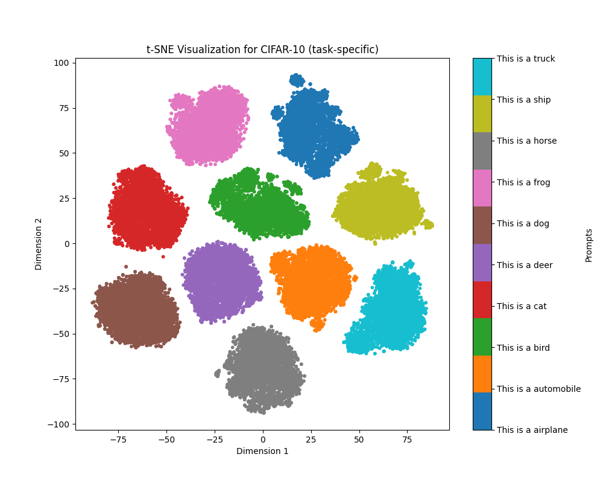
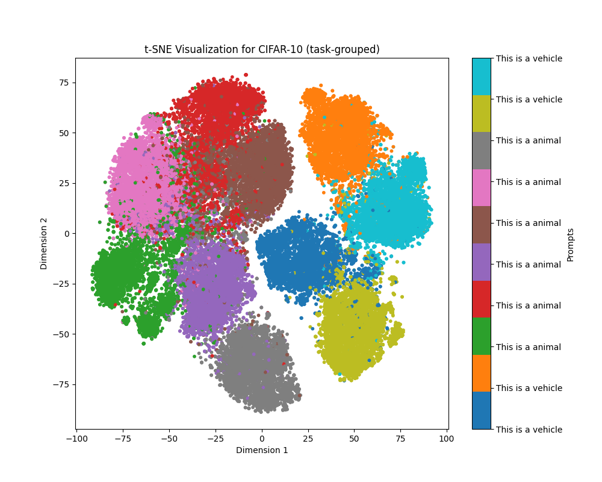

# **Improving Image Classification Tasks using Fused Embeddings and Multimodal Models**

This repository implements a novel framework for leveraging CLIP-based multimodal embeddings with guided textual prompts to enhance image clustering and classification tasks. By pairing image and text embeddings dynamically, the project explores how prompts can structure embedding spaces for semantic alignment, enabling improved clustering, visualization, and classification performance.

---

## **Features**
- **Prompt Engineering**: Leverages task-specific, grouped, swapped, and hierarchical prompts to align embeddings with semantic intent.
- **Multimodal Embeddings**: Combines image and text features using CLIP to create fused embeddings.
- **Clustering Algorithms**: Supports flexible clustering strategies, including Spectral Clustering and others, with reusable cluster results.
- **Classification Workflow**: Predicts labels for test images by aligning prompts and cluster centers.
- **Visualization Tools**: Employs t-SNE for visualizing embedding space separability under different prompting strategies.
- **Extensible Framework**: Easily add new datasets, prompts, or clustering methods.

---

## **Installation**
1. Clone this repository:
   ```bash
   git clone https://github.com/arturandre/classification-fused-embeddings.git
   cd classification-fused-embeddings
   ```
2. Set up a Python environment (recommended `Python >= 3.8`):
   ```bash
   python -m venv env
   source env/bin/activate  # For Linux/Mac
   env\Scripts\activate     # For Windows
   ```
3. Install the required dependencies:
   ```bash
   pip install -r requirements.txt
   ```

---

## **Usage**
### **Command-line Options**
Run the main pipeline with the following options:
```bash
python main_paper.py --output_folder results --reuse_embeddings --recompute_stats
```
- `--output_folder`: Path to save clustering results, embeddings, and visualizations.
- `--reuse_embeddings`: Reuse saved embeddings to skip computation.
- `--recompute_stats`: Recompute statistics and regenerate visualizations.

---

### **Example Workflow**
1. **Dataset Configuration**:
   - Supported datasets include `MNIST`, `CIFAR-10`, and subsets of `CIFAR-100`.
   - Prompts are defined in `datasets_config` for task-specific, grouped, swapped, and hierarchical strategies.

2. **Run the Main Script**:
   ```bash
   python main_paper.py
   ```
   This will:
   - Extract embeddings for all configured datasets.
   - Perform clustering and evaluate results for all prompt strategies.
   - Save metrics, visualizations, and classification reports in the specified `--output_folder`.

3. **Inspect Results**:
   - Embeddings and cluster results are saved as `.npy` and `.pkl` files in the `output_folder`.
   - t-SNE visualizations are stored in the `tsne` subdirectory for each dataset.

---

## **Repository Structure**
```
.
├── main_paper.py          # Main script for clustering and classification
├── datasets_config.py     # Configuration for datasets and prompts
├── requirements.txt       # Dependencies for the project
├── results/               # Default output folder for embeddings and visualizations
├── README.md              # Project documentation
```

---

## **Visualization Examples**
### CIFAR-10 (Task-Specific Prompts)


### CIFAR-10 (Grouped Prompts)


---

## **Metrics**
The framework evaluates clustering and classification performance using:
- **Silhouette Score**: Measures intra-cluster compactness and inter-cluster separability.
- **Adjusted Rand Index (ARI)**: Compares clustering results with ground truth.
- **Normalized Mutual Information (NMI)**: Evaluates shared information between cluster assignments and true labels.
- **Classification Accuracy**: Measures alignment between predicted and true labels.

---

## **Key Results**
| **Dataset**      | **Prompt Strategy** | **Accuracy ↑** | **ARI ↑** | **NMI ↑** |
|------------------|---------------------|----------------|-----------|-----------|
| **CIFAR-10**     | Task-Specific       | 87.92%         | 0.8591    | 0.8964    |
| **CIFAR-10**     | Grouped             | 62.32%         | 0.6523    | 0.7138    |
| **CIFAR-10**     | Image-Only          |  9.93%         | 0.5885    | 0.7487    |

---

## **Citation**
If you use this code, please cite our work:
```bibtex
@inproceedings{oliveira2025improving,
  author    = {Artur A. Oliveira and Mateus Espadoto and Roberto Hirata Jr. and Roberto M. Cesar Jr.},
  title     = {Improving Image Classification Tasks Using Fused Embeddings and Multimodal Models},
  booktitle = {Proceedings of VISIGRAPP (2: VISAPP) 2025},
  volume    = {232},
  pages     = {232--241},
  year      = {2025},
  publisher = {SciTePress},
  url       = {https://www.scitepress.org/Papers/2025/133656/133656.pdf}
}
```
